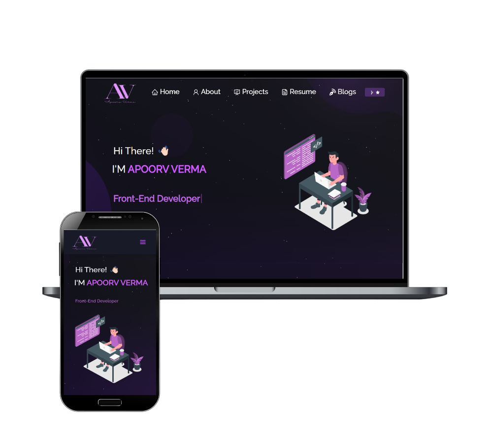
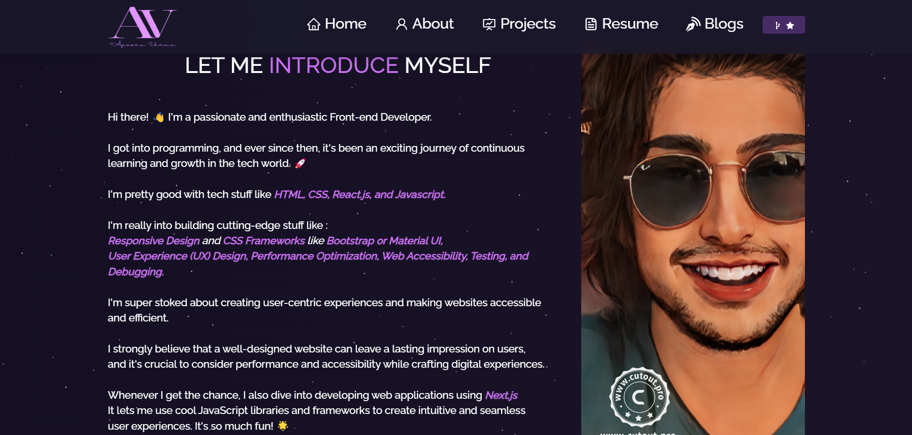

## 🌐[Apoorv Verma - Portfolio Website](https://apoorv-verma-portfolio.vercel.app/)

  

Welcome to my vibrant and dynamic portfolio website 🚀 Explore a fusion of technology, creativity, and personal growth, encapsulated in this digital journey.

## 🚀 Overview

Dive into an immersive experience that showcases my skills, projects, and personality. This interactive portfolio is designed to inspire, engage, and inform.

## 🛠️ Technologies Used

- **React**: Powering the interactivity and smooth navigation.
- **React Bootstrap**: Elevating the design aesthetics and responsiveness.
- **JavaScript**: Enabling dynamic content and animations.
- **HTML5 & CSS3**: Creating the foundation for a visually appealing layout.
- **Various React Icons & Libraries**: Adding delightful visual elements.
- **PDF.js**: Seamlessly displaying my resume in the browser.

## 🌟 Features

- **Engaging UI**: A visually pleasing interface with smooth animations.
- **Project Showcase**: Discover my recent projects with detailed descriptions, GitHub links, and live demos.
- **About Me**: Get to know me better through a compelling narrative and engaging content.
- **Responsive Design**: Optimized for viewing on various devices, from desktops to mobiles.
- **Interactive Sections**: Engaging icons and animations guide you through different parts of the portfolio.
- **Resume Download**: Grab a copy of my resume for a comprehensive overview of my skills and experience.

## 🚀 Usage

1. Explore the [Portfolio Website](https://apoorv-verma-portfolio.vercel.app/).
2. Navigate seamlessly through the various sections using the intuitive menu.
3. Dive into each project's details, interact with live demos, and explore GitHub repositories.
4. Capture a snapshot of my journey by downloading the PDF version of my resume.
5. Connect with me through the provided social media links and let's embark on a journey of innovation and growth together!
## 📸 Screenshots

---
Thank you for visiting my portfolio website! 🌟 If you'd like to get in touch, collaborate, or have any questions, feel free to reach out through the provided links. Let's create something amazing together! 🚀🌈
