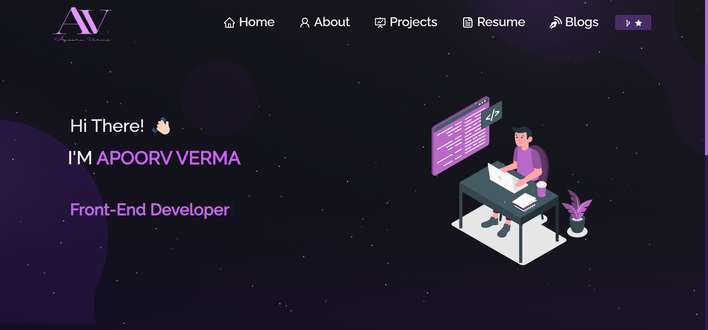

<h2 align="center">
  Portfolio Website - v2.0 
  <a href="https://apoorv-verma-portfolio.vercel.app/" target="_blank">Apoorv Verma</a>
</h2>

  

## Apoorv Verma - Portfolio Website

Welcome to my portfolio website v2.0! This is a showcase of my recent works, skills, and a little bit about myself. Feel free to explore and learn more about me.

### Overview

This portfolio website is built using React, React Bootstrap, and various other technologies. It includes several sections such as:

- **About Me**: Learn more about my background, education, and professional journey. I'm a dynamic individual passionate about technology, writing blogs, and gaming.

- **Professional Skillset**: Discover the technologies I'm proficient in. From HTML, CSS, and JavaScript to React, Node.js, and more.

- **Tools I Use**: Explore the tools and frameworks I use to create stunning web applications.

- **Projects**: Check out some of my recent works, including a Twitter Clone, Google Doc Clone, Gym Website, Kanban Board, and Calendar with DatePicker.

- **Resume**: View or download my resume to get a detailed overview of my skills and experience.

- **Contact Me**: Find links to my social media profiles like GitHub, Twitter, LinkedIn, and Instagram. Feel free to connect!

### Technologies Used

- React
- React Bootstrap
- JavaScript
- HTML5
- CSS3
- Various React icons and libraries
- PDF.js for displaying my resume

### Features

- Responsive design for optimal viewing on different devices.
- Interactive sections with animations and icons.
- Project cards with descriptions, GitHub links, and live demos.
- Smooth scrolling navigation.
- Downloadable PDF version of my resume.

### How to Use

1. Visit the [Portfolio Website](https://apoorv-verma-portfolio.vercel.app/).
2. Explore different sections using the navigation menu.
3. Click on project cards to learn more about each project.
4. Download my resume to learn more about my skills and experience.
5. Connect with me on social media through the provided links.

### Screenshots

---

Thanks for checking out my portfolio website! If you have any questions or would like to get in touch, feel free to connect with me through the provided links.